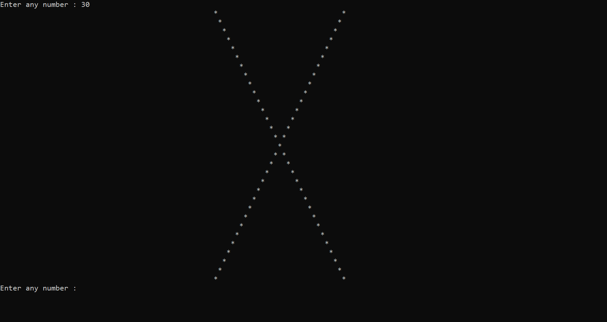
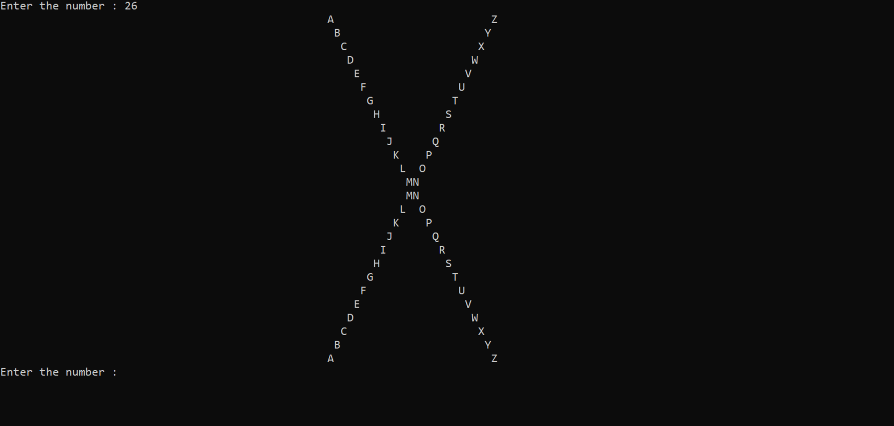

<!--doing a c programme that print x-->

_P_ ~~a~~__tt__`ern` X</br>
---  
<p> //write a programme that print x pattern</p>

- [x] star
- [x] hesh
- [x] alphabet

```c
#include<stdio.h>
int main()
{
    while(1)
    {
        int num, row, col,space;
        printf("Enter any number : ");
        scanf("%d",&num);
        if(num%2==0)
        {
            num=num+1; // By using this theory the even number also print x pattern otherwise not.
        }

        for(row=num; row>1; row=row-2)
        {
            for(space=1; space<=((num-row)/2)+50; space++)  // adding 50 to show in middle of the page
            {
                printf(" ");
            }
            for(col=1; col<=row; col++)
            {
                if(col==row || col==1)

                    printf("*");
                else
                    printf(" ");
            }
            printf("\n");
        }

        for(row=1; row<=num; row=row+2)
        {
            for(space=1; space<=((num-row)/2)+50; space++)
            {
                printf(" ");
            }

            for(col=1; col<=row; col++)
            {
                if(col==1 || col==row)
                {
                    printf("*");
                }
                else
                    printf(" ");
            }
            printf("\n");
        }
    }
}
```  



// write a programme that print alphabet

```c
#include<stdio.h>
int main()
{
    while(1)
    {
        int num,row,col,space;
        printf("Enter the number : ");
        scanf("%d",&num);
        for(row=1; row<=num; row++)
        {
            for(space=1; space<=50; space++) // for space is not mendatory
            {
                printf(" ");
            }
            for(col=1; col<=num; col++)
            {
                if(row==col || row+col==num+1)
                    printf("*");
                else
                    printf(" ");
            }
            printf("\n");
        }
    }
}
```

<image src="./images/star1.png" width="500" title="New style" />

<p> //write a programme that print alphabet</p>

```c
#include<stdio.h>
int main()
{
    while(1)
    {
        int num,row,col,space;
        printf("Enter the number : ");
        scanf("%d",&num);
        for(row=1; row<=num; row++)
        {
            for(space=1; space<=50; space++) // for space is not mendatory
            {
                printf(" ");
            }
            for(col=1; col<=num; col++)
            {
                if(row==col || row+col==num+1)
                    printf("%c",col+64);
                else
                    printf(" ");
            }
            printf("\n");
        }
    }
}
```

</br>

continue editing...